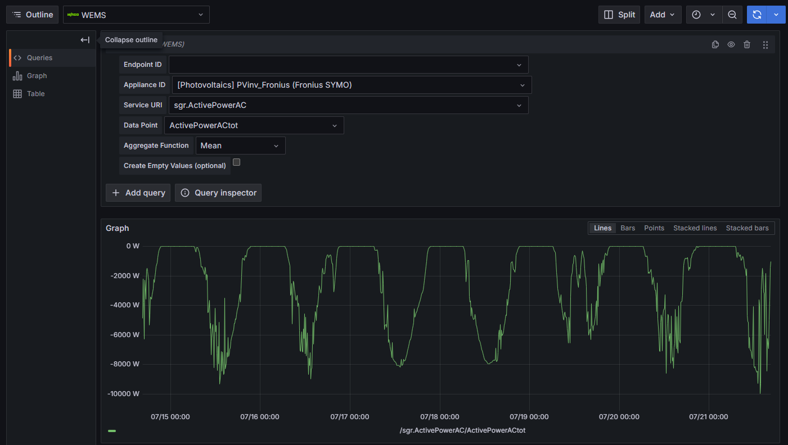

# WEMS Grafana Datasource Plugin

A Grafana datasource plugin for integrating and visualizing data from the **WAGO Energy Management System (WEMS)**. This plugin enables users to query, monitor, and analyze energy data directly within Grafana dashboards with a user-friendly interface and powerful querying capabilities.



## Features

- **Seamless Integration**: Direct connection to WEMS API with OAuth2-style authentication
- **Time Series Data**: Query historical energy data with configurable time ranges
- **Hierarchical Data Structure**: Navigate through Endpoints → Appliances → Services → Data Points
- **Multiple Aggregation Functions**: Mean, median, min, max, sum, count, first, last, derivative
- **Smart Unit Mapping**: Automatic conversion of WEMS units to Grafana-friendly formats
- **Value Mapping**: Support for enum and binary value types with proper labeling
- **Performance Optimized**: Concurrent API calls and intelligent token caching
- **Developer Friendly**: Comprehensive error handling and validation

## Requirements

- **Grafana**: Version 10.4.0 or higher
- **WEMS API**: Client ID and Client Secret for authentication
- **Network Access**: Connection to WEMS API endpoint (default: `https://c1.api.wago.com/wems`)

## Installation

### Manual Installation (WAGO Servers)

1. **Build the plugin:**
   ```bash
   npm run build
   mage -v build:linux
   ```

2. **Deploy to Grafana:**
   ```bash
   # Create plugin directory
   sudo mkdir -p /var/lib/grafana/plugins/wago-wemsgrafanaplugin-datasource
   
   # Copy plugin files
   sudo cp -r dist/* /var/lib/grafana/plugins/wago-wemsgrafanaplugin-datasource/
   ```

3. **Configure Grafana:**
   Add the following line to `/etc/grafana/grafana.ini`:
   ```ini
   allow_loading_unsigned_plugins = wago-wemsgrafanaplugin-datasource
   ```

4. **Restart Grafana:**
   ```bash
   sudo systemctl restart grafana-server
   ```

### Development Installation

1. **Clone and setup:**
   ```bash
   git clone <repository-url>
   cd wago-wemsgrafanaplugin-datasource
   npm install
   ```

2. **Start development environment:**
   ```bash
   npm run server
   ```

## Configuration

1. **Add WEMS Datasource** in Grafana
2. **Configure Connection:**
   - **Client ID**: Your WEMS API client ID
   - **Client Secret**: Your WEMS API client secret  
   - **Base URL**: WEMS API endpoint (optional, defaults to `https://c1.api.wago.com/wems`)

3. **Test Connection** using the "Save & Test" button

## Usage

### Creating Queries

The plugin provides a hierarchical query builder:

1. **Select Endpoint**: Choose from available WEMS endpoints
2. **Select Appliance**: Pick an appliance from the selected endpoint
3. **Select Service**: Choose a service from the appliance
4. **Select Data Point**: Pick the specific data point to query
5. **Configure Aggregation**: Choose aggregation function (mean, max, etc.)
6. **Optional Settings**: Enable "Create Empty Values" if needed

### Query Model

```typescript
{
  endpoint_id: string;           // WEMS endpoint identifier
  appliance_id: string;         // Appliance identifier
  service_uri: string;          // Service URI path
  data_point: string;           // Specific data point name
  aggregate_function?: string;  // Aggregation method (default: 'mean')
  create_empty_values?: boolean; // Fill gaps in data
}
```

### Supported Data Types

- **Numeric Values**: Voltage, current, power, energy, temperature, etc.
- **Boolean Values**: Binary states, alarms, switches
- **Enumerated Values**: Status indicators with predefined labels
- **Units**: Automatic mapping (VOLTS → V, WATTS → W, AMPERES → A, etc.)

## Development

### Prerequisites

- **Node.js**: Version 22 or higher
- **Go**: For backend development
- **Mage**: Build tool for Go

### Setup Development Environment

1. **Install dependencies:**
   ```bash
   npm install
   go mod tidy
   ```

2. **Start development server:**
   ```bash
   npm run dev      # Frontend development with watch mode
   npm run server   # Start Grafana development environment
   ```

3. **Build for production:**
   ```bash
   npm run build                # Build frontend
   mage -v                     # Build backend for all platforms
   mage -v build:linux         # Build backend for Linux only
   ```

### Testing

- **Unit Tests**: `npm run test` or `npm run test:ci`
- **E2E Tests**: `npm run e2e` (requires `npm run server` first)
- **Linting**: `npm run lint` or `npm run lint:fix`
- **Type Checking**: `npm run typecheck`

### Backend Architecture

The backend is built with Go using the Grafana Plugin SDK:

- **Authentication**: OAuth2-style token management with auto-refresh
- **API Integration**: RESTful communication with WEMS API
- **Data Processing**: Time series data transformation and aggregation
- **Resource Handlers**: Dynamic loading of endpoints, appliances, services, and data points

### Frontend Architecture

The frontend uses React with Grafana UI components:

- **ConfigEditor**: Datasource configuration interface
- **QueryEditor**: Interactive query builder with cascading dropdowns
- **Type Definitions**: TypeScript interfaces for type safety

## API Endpoints

The plugin exposes several resource endpoints for dynamic data loading:

- `/resources/endpoint-list` - List available WEMS endpoints
- `/resources/appliance-list?endpointId=<id>` - List appliances for an endpoint
- `/resources/service-list?endpointId=<id>&applianceId=<id>` - List services for an appliance
- `/resources/datapoint-list?endpointId=<id>&applianceId=<id>&serviceUri=<uri>` - List data points
- `/resources/datapoint-unit?endpointId=<id>&applianceId=<id>&serviceUri=<uri>&datapoint=<name>` - Get unit and valid values

## Troubleshooting

### Debug Mode

Enable debug logging in Grafana configuration:
```ini
[log]
level = debug
```

### Network Requirements

- **Outbound HTTPS**: Port 443 to WEMS API endpoint
- **Authentication**: Valid WEMS API credentials
- **Firewall**: Allow Grafana server to reach WEMS API

## License

Apache License 2.0 - see [LICENSE](LICENSE) file for details.
