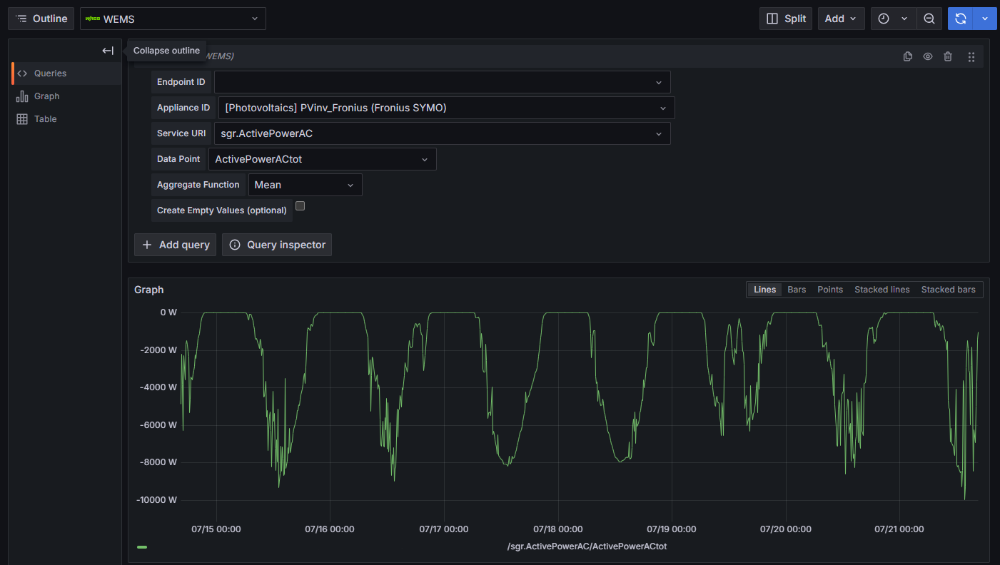

# WEMS Grafana Datasource Plugin

A Grafana datasource plugin for integrating and visualizing data from the **WAGO Energy Management System (WEMS)**. This plugin enables users to query, monitor, and analyze energy data directly within Grafana dashboards with a user-friendly interface.



## Features

- **Hierarchical Data Structure**: Navigate through Endpoints → Appliances → Services → Data Points
- **Multiple Aggregation Functions**: Mean, median, min, max, sum, count, first, last, derivative
- **Unit Mapping**: Automatic conversion of WEMS units to Grafana-friendly formats

## Requirements

| Component | Requirement |
|---|---|
| **Grafana** | Version 11.5.0 or higher |
| **Access** | Administrative access to the Grafana server and its configuration file |
| **WEMS API** | Client ID and Client Secret for authentication |
| **Network** | Outbound HTTPS (port 443) to the WEMS API (default: `https://c1.api.wago.com/wems`) |

---

# Installation

This plugin is **not signed by Grafana**, so Grafana has to be told explicitly that it is allowed to load it. Skipping that step is by far the most common reason the plugin does not show up after installation.

The steps below cover a standard Linux installation and Docker. You need shell access to the Grafana host and permission to restart Grafana.

## Step 1: Download the plugin

Download the archive from the GitHub releases page:

**https://github.com/WAGO/wems-grafana-datasource-plugin/releases/latest**

```bash
wget https://github.com/WAGO/wems-grafana-datasource-plugin/releases/download/v0.1.2/wago-wemsgrafanaplugin-datasource-0.1.2.zip
```

> Replace `v0.1.2` / `0.1.2` with the version you want to install. The archive is roughly 48 MB because it bundles the backend binaries for every supported platform.

## Step 2: Extract into the Grafana plugin directory

The archive already contains a top-level `wago-wemsgrafanaplugin-datasource/` folder, so extract it directly into the plugin directory — do not create the folder yourself:

```bash
# Default plugin directory for a package-based Grafana installation
sudo unzip wago-wemsgrafanaplugin-datasource-0.1.2.zip -d /var/lib/grafana/plugins/

# Verify the plugin folder exists
ls -la /var/lib/grafana/plugins/wago-wemsgrafanaplugin-datasource
```

> If your Grafana uses a non-default location, check the `paths.plugins` setting in `grafana.ini` and extract there instead.

## Step 3: Allow the unsigned plugin

Use **Option A** for a normal package installation, or **Option B / C** when running Grafana in Docker.

### Option A: Using `grafana.ini`

1. Open the Grafana configuration file:

   ```bash
   sudo nano /etc/grafana/grafana.ini
   ```

2. Find the `[plugins]` section and locate the `allow_loading_unsigned_plugins` parameter.

3. Uncomment the line (remove the leading `;`) and add the plugin ID:

   ```ini
   [plugins]
   # Enter a comma-separated list of plugin identifiers to identify plugins
   # that are allowed to be loaded even if they lack a valid signature
   allow_loading_unsigned_plugins = wago-wemsgrafanaplugin-datasource
   ```

> **Note:** To allow multiple unsigned plugins, use a comma-separated list with no spaces:
>
> ```ini
> allow_loading_unsigned_plugins = wago-wemsgrafanaplugin-datasource,another-plugin-id
> ```

### Option B: Using an environment variable (`docker run`)

```bash
docker run -d \
  -p 3000:3000 \
  -e "GF_PLUGINS_ALLOW_LOADING_UNSIGNED_PLUGINS=wago-wemsgrafanaplugin-datasource" \
  -v /path/to/wago-wemsgrafanaplugin-datasource:/var/lib/grafana/plugins/wago-wemsgrafanaplugin-datasource \
  grafana/grafana:latest
```

### Option C: Using `docker-compose.yml`

```yaml
services:
  grafana:
    image: grafana/grafana:latest
    ports:
      - "3000:3000"
    environment:
      - GF_PLUGINS_ALLOW_LOADING_UNSIGNED_PLUGINS=wago-wemsgrafanaplugin-datasource
    volumes:
      - ./wago-wemsgrafanaplugin-datasource:/var/lib/grafana/plugins/wago-wemsgrafanaplugin-datasource
```

Then start it with `docker compose up -d`.

## Step 4: Make the backend binary executable

This plugin has a Go backend that Grafana starts as a separate process. The ZIP does not always preserve the executable bit, so set it explicitly for **your** platform:

```bash
sudo chmod +x /var/lib/grafana/plugins/wago-wemsgrafanaplugin-datasource/gpx_wems_grafana_plugin_linux_amd64
```

| Platform | Binary |
|---|---|
| Linux x86-64 | `gpx_wems_grafana_plugin_linux_amd64` |
| Linux ARM64 | `gpx_wems_grafana_plugin_linux_arm64` |
| Linux ARM (32-bit) | `gpx_wems_grafana_plugin_linux_arm` |
| macOS (Intel) | `gpx_wems_grafana_plugin_darwin_amd64` |
| macOS (Apple Silicon) | `gpx_wems_grafana_plugin_darwin_arm64` |
| Windows x86-64 | `gpx_wems_grafana_plugin_windows_amd64.exe` |

Grafana picks the matching binary automatically — you only need the executable bit on the one for your platform. If you are unsure, run `uname -m`: `x86_64` → `linux_amd64`, `aarch64` → `linux_arm64`.

## Step 5: Restart Grafana

```bash
# For systemd-based systems
sudo systemctl restart grafana-server

# For Docker
docker restart <container_name>
```

## Step 6: Verify the installation

1. Log into Grafana and open **Administration → Plugins and data → Plugins** (or go directly to `/plugins`).
2. Set the filter to **All** — unsigned plugins are hidden when the list is filtered to signed ones.
3. Search for `WEMS`. The plugin appears as **WEMS** with an **Unsigned** badge.

You can also confirm it from the server log:

```bash
sudo journalctl -u grafana-server | grep -i wems      # systemd
docker logs <container_name> 2>&1 | grep -i wems      # Docker
```

A successful load logs `Plugin registered  pluginId=wago-wemsgrafanaplugin-datasource`.

## Step 7: Configure the data source

1. Go to **Connections → Data sources** (or `/connections/datasources`).
2. Click **Add new data source**.
3. Select **WEMS**.
4. Fill in the connection details:

   | Field | Description |
   |---|---|
   | **Client ID** | Your WEMS API client ID |
   | **Client Secret** | Your WEMS API client secret |
   | **Base URL** | Optional. Defaults to `https://c1.api.wago.com/wems` |

5. Click **Save & test**. A green *Data source is working* confirms the credentials and network path.

The data source is now ready to use in dashboards and Explore.

---

## Usage

### Creating Queries

The plugin provides a hierarchical query builder:

1. **Select Endpoint**: Choose from available WEMS endpoints
2. **Select Appliance**: Pick an appliance from the selected endpoint
3. **Select Service**: Choose a service from the appliance
4. **Select Data Point**: Pick the specific data point to query
5. **Configure Aggregation**: Choose aggregation function (mean, max, etc.)
6. **Optional Settings**: Enable "Create Empty Values" if needed

### Query Model

```typescript
{
  endpoint_id: string;           // WEMS endpoint identifier
  appliance_id: string;         // Appliance identifier
  service_uri: string;          // Service URI path
  data_point: string;           // Specific data point name
  aggregate_function?: string;  // Aggregation method (default: 'mean')
  create_empty_values?: boolean; // Fill gaps in data
}
```

### Supported Data Types

- **Numeric Values**: Voltage, current, power, energy, temperature, etc.
- **Boolean Values**: Binary states, alarms, switches
- **Enumerated Values**: Status indicators with predefined labels
- **Units**: Automatic mapping (VOLTS → V, WATTS → W, AMPERES → A, etc.)


## Development

### Prerequisites

- **Node.js**: Version 22 or higher
- **Go**: For backend development
- **Mage**: Build tool for Go (`go install github.com/magefile/mage@latest`)
- **Docker**: For the local Grafana development environment

### Setup

```bash
git clone https://github.com/WAGO/wems-grafana-datasource-plugin.git
cd wems-grafana-datasource-plugin
npm install
go mod tidy
```

### Build and run

```bash
npm run dev      # Frontend development with watch mode
npm run server   # Start the local Grafana development environment
```

```bash
npm run build            # Build frontend
mage -v                  # Build backend for all platforms
mage -v build:linux      # Build backend for Linux only
```

> Backend (Go) changes require `mage -v` **and** a Grafana restart to take effect — rebuilding the frontend alone is not enough.

### Install a locally built plugin

```bash
sudo mkdir -p /var/lib/grafana/plugins/wago-wemsgrafanaplugin-datasource
sudo cp -r dist/* /var/lib/grafana/plugins/wago-wemsgrafanaplugin-datasource/
```

Then follow **Step 4** onwards of the installation guide above.

### Testing

- **Unit Tests**: `npm run test` or `npm run test:ci`, and `go test ./pkg/...` for the backend
- **E2E Tests**: `npm run e2e` (requires `npm run server` first)
- **Linting**: `npm run lint` or `npm run lint:fix`
- **Type Checking**: `npm run typecheck`

### Backend Architecture

The backend is built with Go using the Grafana Plugin SDK:

- **Authentication**: OAuth2-style token management with auto-refresh
- **API Integration**: RESTful communication with WEMS API
- **Data Processing**: Time series data transformation and aggregation
- **Resource Handlers**: Dynamic loading of endpoints, appliances, services, and data points

### Frontend Architecture

The frontend uses React with Grafana UI components:

- **ConfigEditor**: Datasource configuration interface
- **QueryEditor**: Interactive query builder with cascading dropdowns
- **Type Definitions**: TypeScript interfaces for type safety

### API Endpoints

The plugin exposes several resource endpoints for dynamic data loading:

- `/resources/endpoint-list` - List available WEMS endpoints
- `/resources/appliance-list?endpointId=<id>` - List appliances for an endpoint
- `/resources/service-list?endpointId=<id>&applianceId=<id>` - List services for an appliance
- `/resources/datapoint-list?endpointId=<id>&applianceId=<id>&serviceUri=<uri>` - List data points
- `/resources/datapoint-unit?endpointId=<id>&applianceId=<id>&serviceUri=<uri>&datapoint=<name>` - Get unit and valid values

## License

Apache License 2.0 - see [LICENSE](LICENSE) file for details.
